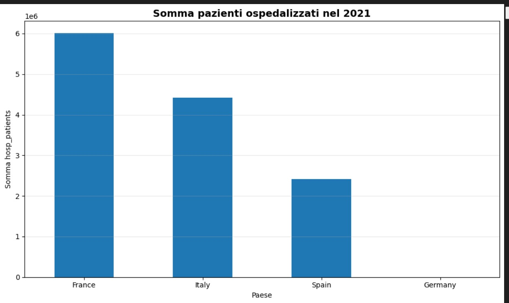
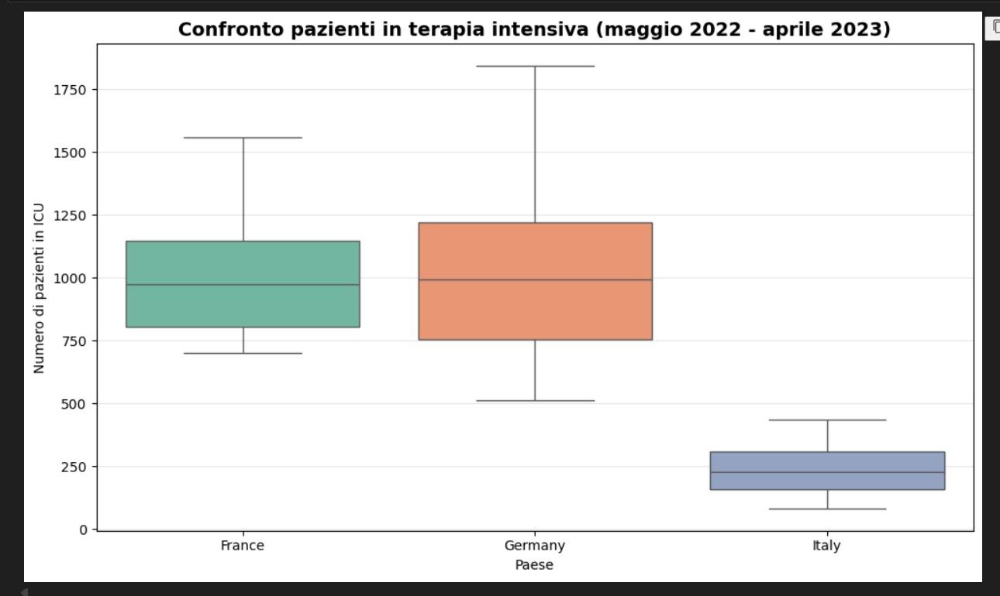
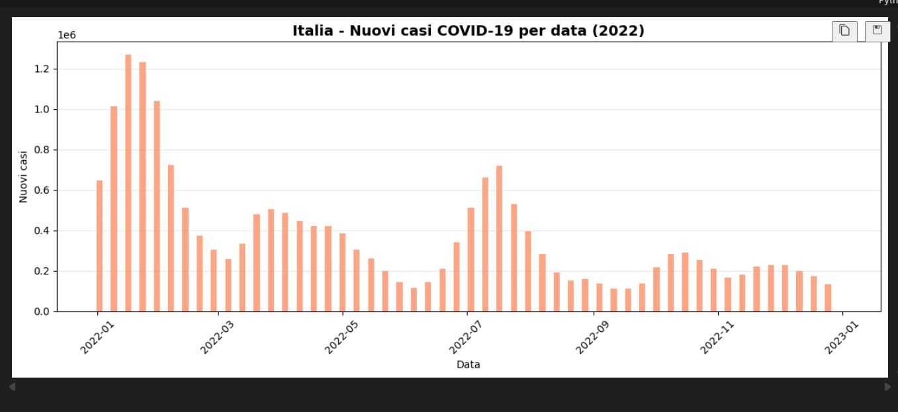
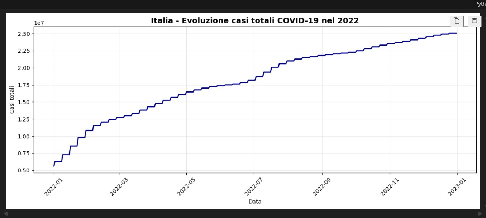
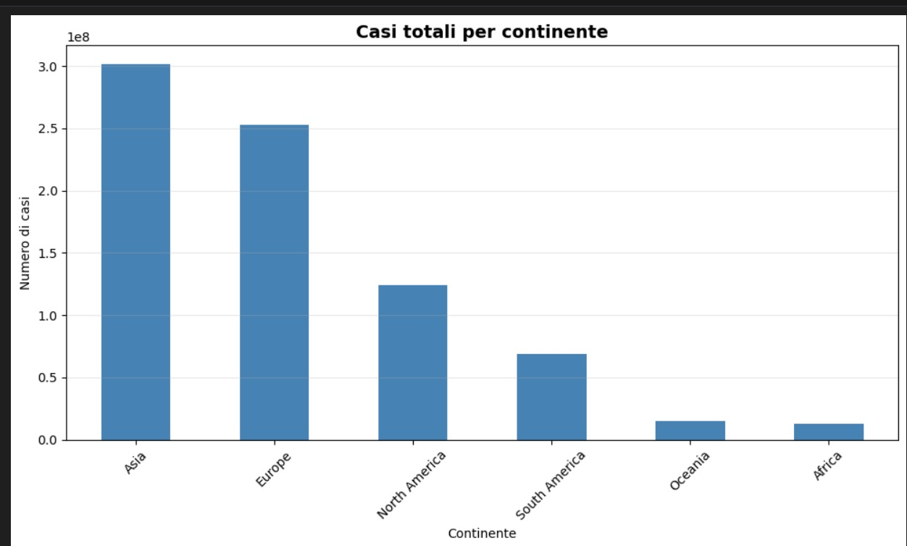

# COVID-19 Global Data Analysis (2020–2025)

## 📌 Project Overview

This project analyzes global COVID-19 data using Python and real-time open datasets.

The analysis includes:

- Country-level comparisons (Italy, France, Germany, Spain)
- ICU patient trends (2022–2023)
- Yearly hospitalization aggregation (2021)
- New cases evolution in Italy (2022)
- Total case growth analysis
- Continental case distribution

Data is dynamically downloaded from the official Our World in Data repository.

---

## 🛠 Tech Stack

- Python 3
- Pandas
- NumPy
- Matplotlib
- Seaborn
- Jupyter Notebook

---

## 🧠 Technical Approach

- Data extraction directly from OWID GitHub repository (Our World in Data)
- Data filtering by country and continent
- Time-series aggregation (2020–2025)
- ICU and hospitalization comparative analysis
- Year-over-year case evolution analysis
- Cross-country distribution analysis

---

## 📊 Data Source

Dataset used:

https://raw.githubusercontent.com/owid/covid-19-data/refs/heads/master/public/data/owid-covid-data.csv

The dataset contains global COVID-19 statistics.  
Filtering and aggregation are performed directly within the notebook.

---

## 🔎 Analysis Performed

- Data filtering by selected countries
- Date parsing and preprocessing
- Aggregation by year
- ICU comparison between European countries
- Hospitalization trend evaluation
- Continent-level total case aggregation
- Time-series visualization for Italy (2022)

---

## 📸 Sample Visualizations

---

## 🚀 How to Run

1. Clone the repository
2. Install dependencies:
